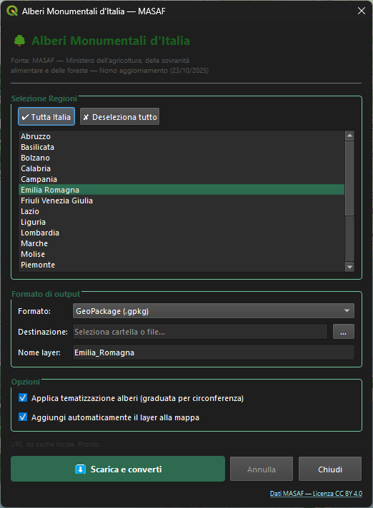

# Alberi Monumentali Italia — Plugin QGIS

Plugin QGIS per scaricare e visualizzare gli **alberi monumentali d'Italia**
dal sito del Ministero dell'agricoltura, della sovranità alimentare e delle foreste (MASAF).

## Funzionalità

- Scarica i dati per **singola regione** o **tutta Italia** direttamente dal sito MASAF
- Aggiornamento automatico degli URL dalla pagina ufficiale
- Converte le coordinate **DMS → gradi decimali WGS84**
- Salva il risultato in **GeoPackage (.gpkg)** o **Shapefile (.shp)**
- **Visualizzazione multi-scala** con due tematizzazioni automatiche (vedi sotto)
- Etichette con il nome volgare della specie (visibili a scale di dettaglio)



## Dipendenze

Il plugin usa esclusivamente pacchetti già inclusi in QGIS — non è necessario installare nulla di aggiuntivo.

| Pacchetto | Versione minima | Note |
|-----------|----------------|------|
| **QGIS** | 3.20 | compatibile con QGIS 4.x / PyQt6 |
| **pandas** | qualsiasi | incluso in QGIS |
| **xlrd** | 1.x | incluso in QGIS; necessario per leggere i file `.xls` MASAF |

> Se in un'installazione personalizzata di QGIS `xlrd` risultasse mancante,
> installarlo con il gestore pacchetti integrato o con:
> ```
> pip install xlrd
> ```

## Installazione

1. Scarica il file [`ami_masaf.zip`](https://github.com/pigreco/ami_masaf/releases/latest)
2. In QGIS: **Plugin → Gestisci e installa plugin → Installa da ZIP**
3. Seleziona il file ZIP e clicca **Installa plugin**

## Utilizzo

1. Apri il plugin dal menu **Web → Alberi Monumentali** o dalla toolbar
2. Seleziona le regioni desiderate (Ctrl+click per selezione multipla) o clicca **Tutta Italia**
3. Scegli il formato di output (GeoPackage consigliato)
4. Seleziona la destinazione
5. Clicca **Scarica e converti**

## Tematizzazione multi-scala

Il plugin carica automaticamente **due layer sovrapposti** con visibilità dipendente dalla scala,
per favorire la lettura dei dati sia in visione d'insieme sia nel dettaglio.

### Layer 1 — Coroplete regionale (zoom out)

> Visibile quando il denominatore di scala è **≥ 1:200.000** (visione panoramica).

Ogni regione è colorata con un'intensità proporzionale alla **densità di alberi monumentali**
(alberi per km²). Usando la densità anziché il conteggio assoluto, il confronto tra regioni
è equo indipendentemente dalla loro dimensione: una regione grande non appare artificialmente
più ricca di alberi solo per la sua superficie.

| Colore | Classe |
|--------|--------|
| Verde chiarissimo | Bassa densità |
| Verde chiaro | — |
| Verde medio | — |
| Verde foresta | — |
| Verde scuro | Alta densità |

La tabella attributi del layer espone sia il campo `densita` (alberi/km²) sia `n_alberi`
(conteggio assoluto). I confini regionali provengono dal dataset ISTAT 2025
(incluso nel plugin, WGS84); densità e conteggio vengono calcolati dinamicamente
dai punti scaricati.

### Layer 2 — Punti individuali (zoom in)

> Visibile a tutte le scale; a zoom out si sovrappone al coroplete come riferimento puntuale.

Ogni albero è rappresentato da un **cerchio verde** di dimensione proporzionale
alla **circonferenza del fusto** (`CIRCF_CM` / `CIRCONFERENZA_FUSTO_CM`), diviso in 5 classi:

| Simbolo | Classe | Circonferenza |
|---------|--------|---------------|
| Cerchio piccolo — verde chiaro | Piccolo | < 200 cm |
| — | Medio | 200–400 cm |
| — | Grande | 400–600 cm |
| — | Molto grande | 600–900 cm |
| Cerchio grande — verde scuro | Monumentale | > 900 cm |

A scale di dettaglio (≤ 1:50.000) vengono attivate le **etichette** con il nome volgare della specie.

## Struttura dei campi

| Campo (SHP)   | Campo (GPKG)            | Descrizione                          |
|---------------|-------------------------|--------------------------------------|
| PROGR         | PROGR                   | Numero progressivo                   |
| REGIONE       | REGIONE                 | Regione                              |
| ID_SCHEDA     | ID_SCHEDA               | Codice scheda MASAF                  |
| PROVINCIA     | PROVINCIA               | Provincia                            |
| COMUNE        | COMUNE                  | Comune                               |
| LOCALITA      | LOCALITA                | Località                             |
| LAT_DMS       | LAT_DMS                 | Latitudine in formato DMS originale  |
| LON_DMS       | LON_DMS                 | Longitudine in formato DMS originale |
| ALTIT_M       | ALTITUDINE_M            | Altitudine (m s.l.m.)               |
| CONT_URB      | CONTESTO_URBANO         | Contesto urbano                      |
| SP_SCI        | SPECIE_SCIENTIFICO      | Specie nome scientifico              |
| SP_VOLG       | SPECIE_VOLGARE          | Specie nome volgare                  |
| CIRCF_CM      | CIRCONFERENZA_FUSTO_CM  | Circonferenza fusto (cm)             |
| ALT_M         | ALTEZZA_M               | Altezza (m)                          |
| CRITERI       | CRITERI_MONUMENTALITA   | Criteri di monumentalità             |
| PROP_DICH     | PROPOSTA_DICHIARAZIONE  | Proposta dichiarazione interesse     |
| LAT_DD        | LATITUDINE_DD           | Latitudine gradi decimali (calcolata)|
| LON_DD        | LONGITUDINE_DD          | Longitudine gradi decimali (calcolata)|

## Dati

I dati provengono dall'elenco ufficiale degli alberi monumentali d'Italia
pubblicato dal MASAF ai sensi della Legge n. 10/2013.

**Licenza dati**: Creative Commons Attribution CC BY 4.0

**Fonte**: https://www.masaf.gov.it/flex/cm/pages/ServeBLOB.php/L/IT/IDPagina/11260

## Note tecniche

- Sistema di riferimento: **WGS84 (EPSG:4326)**
- Le coordinate vengono validate (bbox Italia: lat 36–48, lon 6–19)
- Gli alberi senza coordinate valide vengono saltati e conteggiati nel report finale
